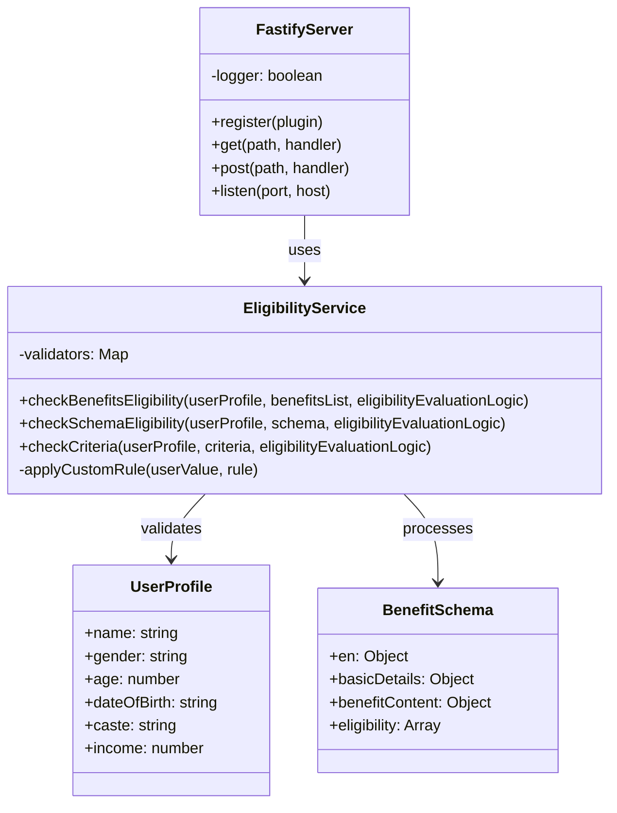

# Class Diagram

This diagram shows the main components and their relationships in the Benefit Eligibility SDK.

## Component Description

### FastifyServer
The main server component that handles HTTP requests and routes them to appropriate handlers.

### EligibilityService
Core service that processes eligibility checks and manages validation rules.

### UserProfile
Data structure representing user information required for eligibility checks.

### BenefitSchema
Structure defining benefit schemes and their eligibility criteria. 