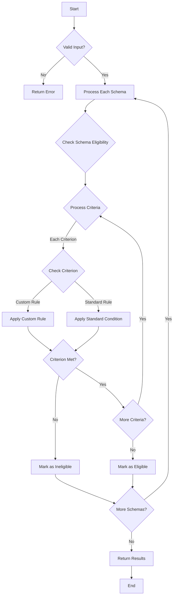

# Flowchart

This flowchart illustrates the decision-making process for determining eligibility.

## Process Description

### Input Validation
- Validates user profile and benefit schema format
- Ensures all required fields are present

### Schema Processing
1. **For Each Schema**
   - Validates schema structure
   - Processes all eligibility criteria

2. **Criteria Evaluation**
   - Checks each criterion individually
   - Applies either custom or standard rules
   - Marks schema as eligible only if all criteria are met

### Result Generation
- Categorizes schemas as eligible or ineligible
- Collects any errors encountered
- Returns comprehensive results

### Decision Points
- Input validation
- Schema eligibility
- Individual criteria evaluation
- Custom vs standard rules
- Final eligibility determination 