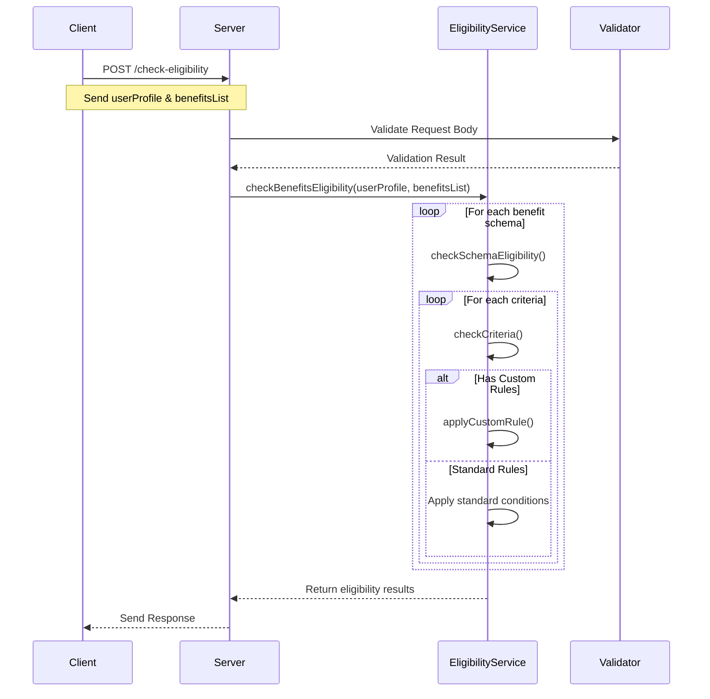

# Sequence Diagram

This diagram illustrates the flow of an eligibility check request through the system.

## Flow Description

1. **Client Request**
   - Client sends a POST request to `/check-eligibility`
   - Request includes user profile and benefit schemas

2. **Input Validation**
   - Server validates the request body using JSON Schema
   - Ensures all required fields are present and correctly formatted

3. **Eligibility Processing**
   - For each benefit schema:
     - Checks all eligibility criteria
     - Applies custom rules if provided
     - Evaluates standard conditions

4. **Response**
   - Returns results categorized as:
     - Eligible benefits
     - Ineligible benefits
     - Any errors encountered 